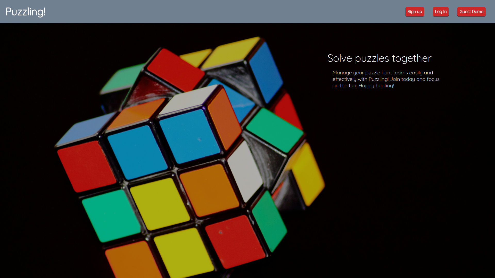
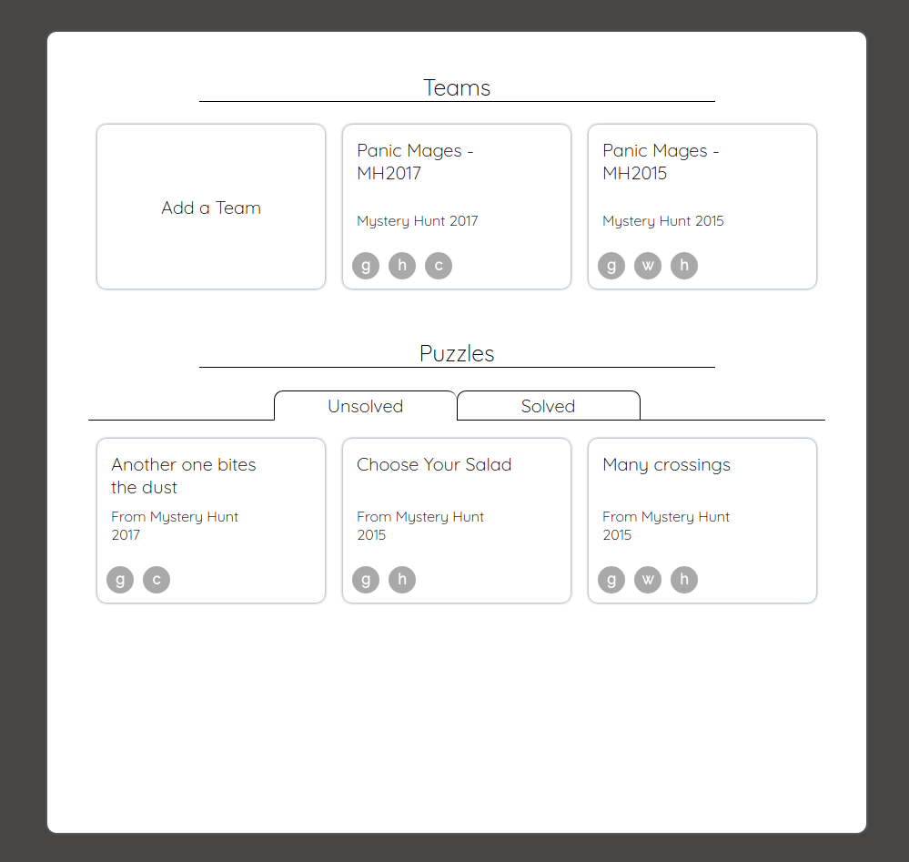
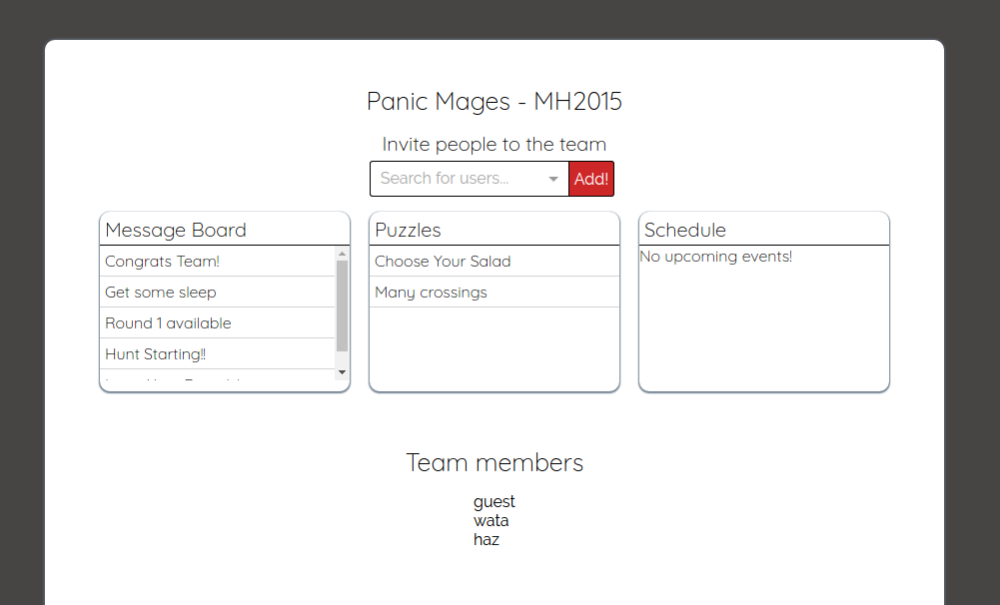
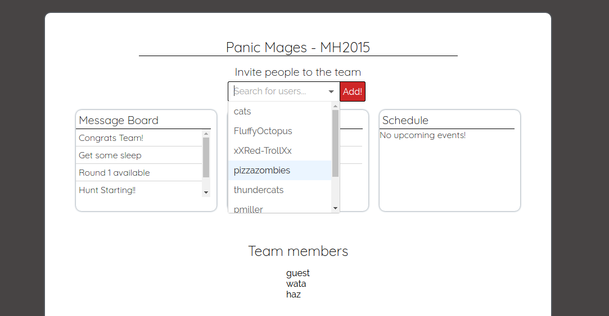
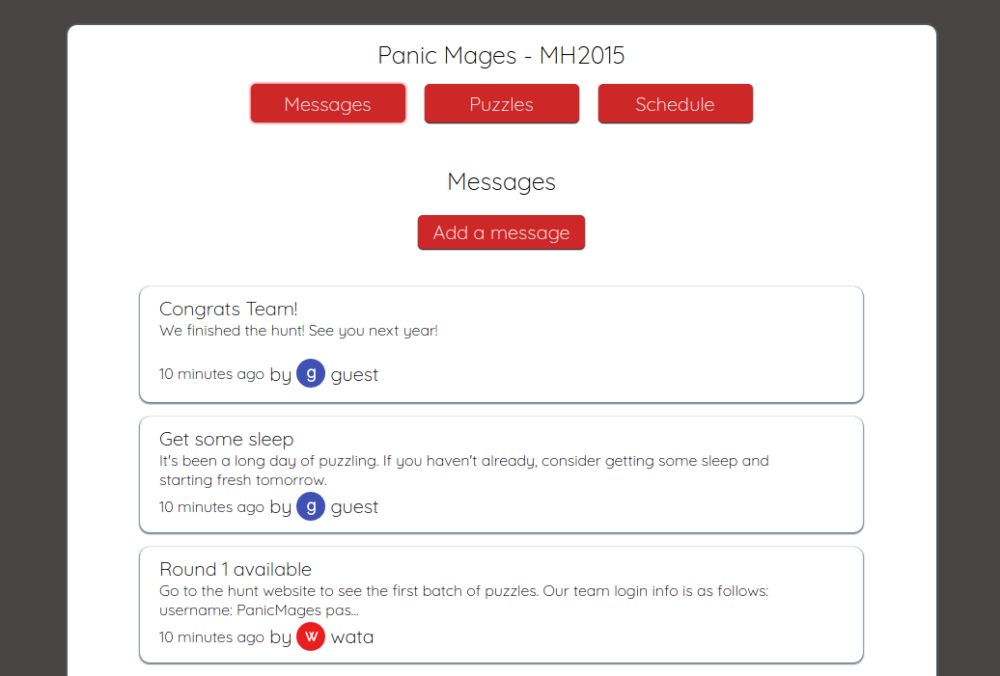
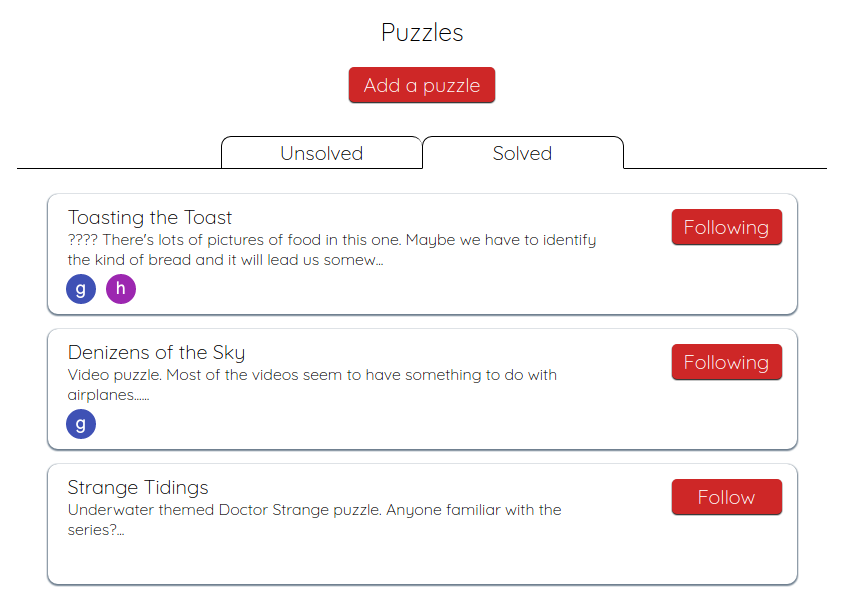
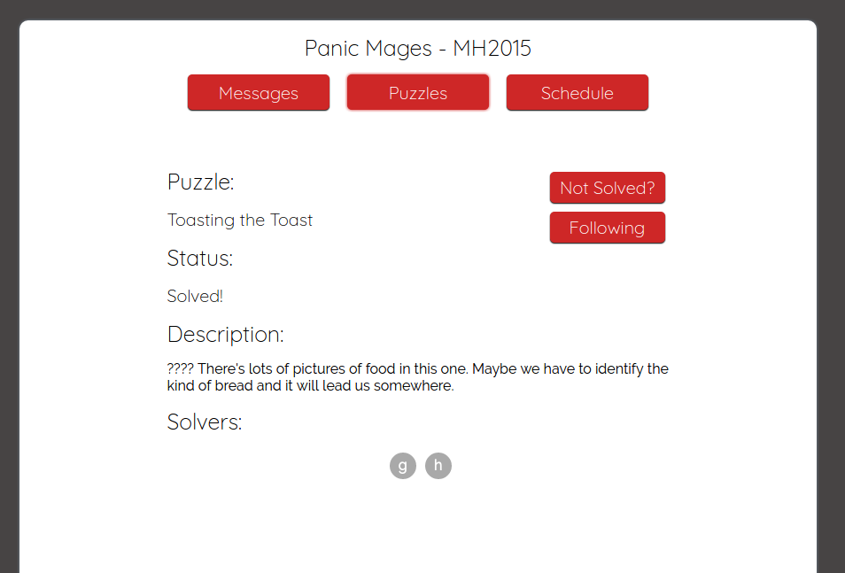

# Puzzling!

[Puzzling! live][heroku]

[heroku]: http://puzzling-app.herokuapp.com/#/teams/1/schedule

Puzzling! is a full-stack web application built to manage teams for puzzle hunt events such as the [MIT Mystery Hunt][mystery]. This app is modeled after Basecamp, and is built on a Ruby-on-Rails back-end with a PostgreSQL database and React/Redux front-end.

[mystery]: http://www.mit.edu/~puzzle/



## Features
  - Simple team management
  - Team message board
  - Schedule events
  - Follow puzzles and see all the puzzles you're working on
  - See who's working with you on a puzzle

#### See all your teams and working puzzles on the homepage


On login, API calls are made to fetch the current user's teams and unsolved puzzles. Clicking on the "Unsolved" or "Solved" tabs will make the appropriate requests to fetch puzzles and update the Redux store. Team creation can be done quickly on this page, with the form React component rendering directly in the "Add a Team" card.

Team cards show user icons for the collection of users on the team. The icon colors are generated by hashing the username with the djb2 hash and indexing into an array of colors:

```javascript
// djb2.js
export default (str, nBins = null) => {
  let hash = 5381;
  for (let i = 0; i < str.length; i++) {
    hash = ((hash << 5) + hash) + str.charCodeAt(i);
  }

  return (nBins) ? ((hash % nBins) + nBins) % nBins : hash;
};

// user_icon.jsx
const UserIcon = ({username}) => {
  let color = colors[djb2(username, colors.length)];

  return (
    <div className={`user-icon-small ${color}`}
      title={username}
      alt={username}>
      <h5>{username[0]}</h5>
    </div>
  );
};
```

#### Quickly see a snapshot of your team's activity


Once in on a team's home page, the team's messages, unsolved puzzles, and upcoming events are available in the Redux store. This lets the user get a quick overview of where the team's state at any point. Users can only enter a team's page if they are a member of that team. The user is verified in the Rails controller and in React to prevent them from accessing a team's data.

#### Find other users to add to your team!


The search bar uses the [React Select][select] package to create a combobox component. When searching for users, asynchronous requests are sent to the database for users not already in the current team, filtering down until the correct user is found. Hitting enter or the "Add!" button adds a new entry to a memberships join table, immediately giving the user access to the team.

[select]: https://github.com/JedWatson/react-select

```javascript
// search_bar.jsx
  getOptions(input) {
    return queryUsers({
      string: input,
      team_id: this.props.team.id
    }).then(options => (
      (options.length > 0) ? {options} : null
    ));
  }

  render() {
    return (
      <div>
        <form className="user-search"
          onSubmit={this.handleSubmit}>
          <Select.Async
            name="user-search-select"
            value={this.state.userId}
            loadOptions={this.getOptions}
            ...
          />
          <input type="submit" value="Add!"/>
        </form>
      </div>
    );
  }
```

#### Post to the message board for team-wide communication


Messages are sorted in reverse post order so newest posts are at the top of the message board.

#### Follow and mark puzzles as solved


#### See who's working on the same puzzle


When fetching puzzle data, the back-end bundles it with user data as well, so the front-end can easily check which users are following each puzzle. "Following" a puzzle will make it available on the current user's home page for quick navigation.

#### Schedule team events!


Event times are communicated between the front-end and back-end as strings following the ISO 8601 format, so the time displayed will always match the browser's time zone. When creating events, a front-end validation prevents users from selecting dates on the calendar where the end date come before the start date.

## Future Directions

As it stands now Puzzling! is currently just an MVP. The following features are planned to add full functionality to the site:

### Comments

Users should be able to comment directly on messages and puzzles to communicate efficiently. Comments will be set up with polymorphic associations in the back-end to accommodate commenting on multiple types of items. Comments will be posted inline on the detail pages and will be fetched in real-time when the project is migrated to Rails 5.

### Google Drive integration

One of the best ways for groups to work remotely on puzzles is through real-time collaborative editing like in Google Docs/Sheets. Using Google's Realtime API, users will be able to work together on a Google Sheet for each puzzle.

### Notifications

On conversion to Rails 5, users will be notified when new puzzles are created in a team or if a puzzle they are working on is solved. Team members will also be able to make group notifications when posting on the message board.
