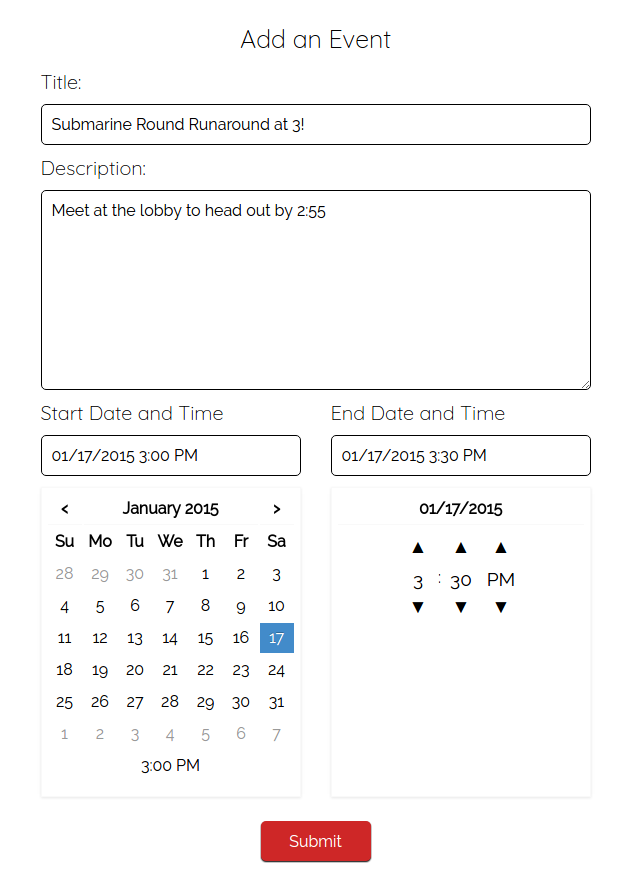

# Puzzling!

[Puzzling! live][heroku]

[heroku]: http://puzzling-app.herokuapp.com/#/teams/1/schedule

Puzzling! is a full-stack web application built to manage teams for puzzle hunt events such as the [MIT Mystery Hunt][mystery]. This app is modeled after Basecamp, and is built on a Ruby-on-Rails backend with a PostgreSQL database and React/Redux frontend.

[mystery]: http://www.mit.edu/~puzzle/

## Features
  - Simple team management
  - Team message board
  - Schedule events
  - Follow puzzles and see all the puzzles you're working on
  - See who's working with you on a puzzle

#### See all your teams and working puzzles on the homepage

#### Quickly see a snapshot of your team activity

#### Find other users to add to your team!

#### Post to the message board for team-wide communication

#### Follow and mark puzzles as solved

#### See who's working on the same puzzle

#### Schedule team events!

## Implementation

## Future Directions

As it stands now Puzzling! is currently just an MVP. The following features are planned to add full functionality to the site:

### Comments

Users should be able to comment directly on messages and puzzles to communicate efficiently. Comments will be set up with polymorphic associations in the backend to accommodate commenting on multiple types of items. Comments will be posted inline on the detail pages and will be fetched in real-time when the project is migrated to Rails 5.

### Google Drive integration

One of the best ways for groups to work remotely on puzzles is through real-time collaborative editing like in Google Docs/Sheets. Using Google's Realtime API, users will be able to work together on a Google Sheet for each puzzle.

### Notifications

On conversion to Rails 5, users will be notified when new puzzles are created in a team or if a puzzle they are working on is solved. Team members will also be able to make group notifications when posting on the message board.
