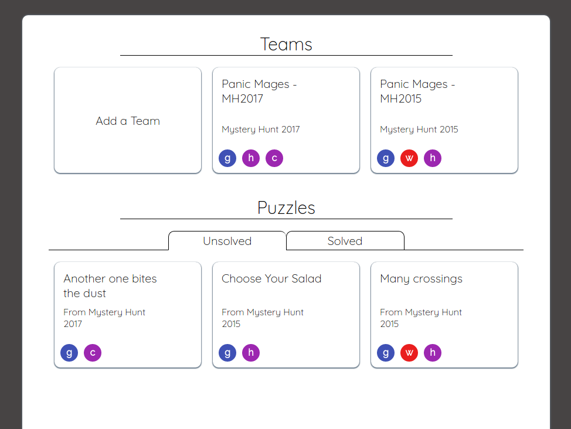

# Puzzling!

[Puzzling! live][heroku]

[heroku]: http://puzzling-app.herokuapp.com/#/teams/1/schedule

Puzzling! is a full-stack web application built to manage teams for puzzle hunt events such as the [MIT Mystery Hunt][mystery]. This app is modeled after Basecamp, and is built on a Ruby-on-Rails backend with a PostgreSQL database and React/Redux frontend.

[mystery]: http://www.mit.edu/~puzzle/

## Features
  - Simple team management
  - Team message board
  - Schedule events
  - Follow puzzles and see all the puzzles you're working on
  - See who's working with you on a puzzle

#### See all your teams and working puzzles on the homepage

#### Quickly see a snapshot of your team activity

#### Find other users to add to your team!

#### Post to the message board for team-wide communication

#### Follow and mark puzzles as solved

#### Schedule team events!

## Future Directions for the Project

In addition to the features already implemented, I plan to continue work on this project.  The next steps for FresherNote are outlined below.

### Search

Searching notes is a standard feature of Evernote.  I plan to utilize the Fuse.js library to create a fuzzy search of notes and notebooks.  This search will look go through tags, note titles, notebook titles, and note content.

### Direct Messaging
